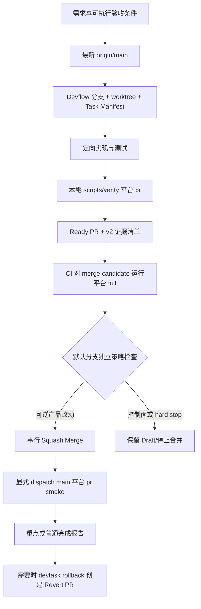

# Mudsnote 自动交付流程 V2

平台范围：每个产品实现任务必须声明 `macos`、`ios` 或明确的 `both`。纯工作流/文档任务可使用 `none`；它不会构建或安装 App。

## 一条默认链路



正常任务不需要用户确认，也不由 Agent 轮询 CI。GitHub 的 `workflow_run` 在 CI 结束后继续处理；同一仓库的合并决策串行执行。如果 `main` 在测试期间前进，自动化只更新任务分支并通过 `workflow_dispatch` 重跑一次当前候选，不会把基于旧 `main` 的绿灯直接用于合并。合并完成后还会把 PR Manifest 的平台范围传给 `main` CI，显式运行该平台的轻量 `pr` smoke；这既避开 `GITHUB_TOKEN` 不产生后续 `push` workflow 的限制，也不重复完整 `full` 矩阵。

## Mudsnote 任务声明

普通 iOS 修复：

```bash
devtask start Mudsnote fix-reader-checkbox \
  --platform ios \
  --domain ios-reader \
  --importance normal \
  --problem "查看态 checkbox 渲染错误" \
  --expected "完成与未完成状态正确显示" \
  --scope "iOS reader 与对应测试"
```

重要但可逆的启动性能优化：

```bash
devtask start Mudsnote optimize-ios-launch \
  --platform ios \
  --domain ios-launch \
  --importance important \
  --problem "大资料库启动时首屏被整库索引阻塞" \
  --expected "首页先可交互，后台索引最终完整" \
  --expected "固定数据集的 TTI 不超过约定阈值"
```

`importance: important|critical` 只要求完成报告突出范围、指标、证据和回退入口；只要可机器验证且可 Git 回退，仍默认自动合并。

以下 hard stop 会保持 Draft：

- `irreversible-data`：无兼容/备份路径的文件格式或真实数据操作；
- `production-release`：App Store、生产部署或正式覆盖安装；
- `signing-or-secret`：证书、签名、密钥和权限操作；
- `guardrail-weakening`：删除检查、放宽断言、扩大 Bot 权限。

此外，`.github/workflows/**`、`.devflow.yaml`、`scripts/verify*`、打包/发布/迁移脚本和 entitlement 由默认分支 workflow 按真实 diff 独立拦截，不能通过在 PR 清单中自称普通任务来绕过。

## 三层验证现在如何分工

| 层级 | 运行位置 | 内容 | 次数 |
|---|---|---|---:|
| 定向测试 | 开发 worktree | 当前根因的单元/少量 UI/性能断言 | 按需 |
| `pr` | `devtask pr` 前 | 受影响平台的快速确定性构建和测试 | 每个提交候选 1 次，可缓存 |
| `full` | GitHub merge candidate | 受影响平台的 Release/完整测试 | 最终候选 1 次 |
| `live` | 本机显式命令 | macOS 正式 App 或 iPhone 真机 | 仅任务明确需要 |

平台命令保持不变：

```bash
./scripts/verify macos pr|full|live
./scripts/verify ios pr|full|live
./scripts/verify both pr|full|live
```

Devflow 的单参数 `./scripts/verify pr|full` 继续根据 diff 推断单个平台；文档和工作流改动只跑策略检查。`live` 永远需要显式平台，iOS-only 任务不会打包或覆盖 `/Applications/Mudsnote.app`。

PR CI 不读取 iCloud、Keychain、真实笔记目录、个人设置、凭证或其他用户数据。真机、分享入口、Widget、真实 iCloud 和正式安装不是自动合并资格的一部分。

## 证据与回退

每个 v2 PR 正文持久保存：

```text
Task ID → base SHA → platform/domain → importance → local PR verify
→ merge-candidate CI → squash merge SHA → rollback command
```

纯代码回归使用：

```bash
devtask rollback Mudsnote <task-id>
```

命令从最新 `origin/main` 建立新任务，只 `git revert` 该任务记录的 squash merge commit，运行相同 PR/CI 链后再合并。它不会 force-push `main`。数据、生产、签名或其他外部副作用会拒绝自动回退，因为 Git 回退不能恢复外部状态。

## 前后对比

| 项目 | V1（之前） | V2（现在） |
|---|---|---|
| 默认 PR | Draft，等待再次确认 | Ready，符合资格后事件驱动合并 |
| 合并基线 | `main` 之外还维护移动的 iOS/macOS 验收 SHA | 最新 `origin/main` 是唯一日常基线 |
| 重要改动 | 容易与“必须确认”混为一谈 | 自动完成，但报告突出证据和回退 |
| 验证 | 本地/PR/合并后容易重复全量执行 | 本地定向 + PR 快速 + merge candidate 完整一次 + main 平台 smoke |
| CI 等待 | Agent 轮询 `gh ... --watch` | `workflow_run`/`workflow_dispatch` 事件驱动 |
| 旧 PR | 长期 Draft 继续影响后续判断 | 没有 v2 manifest 的旧 PR保持手动，不追溯合并 |
| 工作流修改 | 可与产品改动共用同一审批逻辑 | 默认分支独立识别控制面并阻止自我批准 |
| 回退 | 手工查 PR 与 merge SHA | PR 内固定入口；`devtask rollback` 创建 Revert PR |
| 清理 | 所有任务都要再次 `accept` | 自动任务合并后可直接安全 cleanup；held 任务仍需 accept |
| Token 成本 | 重读长文档、Git 考古、重复验证、轮询 | 单一配置、Task Manifest、缓存、摘要日志、无轮询 |

## 对现有开放 PR 的处理

V2 不会自动处理当前历史 Draft PR。它们没有 `devflow-manifest` v2 证据，自动合并 workflow 会直接退出。产品 PR 仍需按各自真实功能与验收证据整理；新的工作流只保证此后可验证、可逆的完成项不再默认滞留在 Draft。

## 清理

自动任务在 PR 已合并、worktree 干净且本地 HEAD 与 PR head 一致后，可直接执行：

```bash
devtask cleanup Mudsnote <task-id> --confirm <task-id> --delete-remote
```

涉及外部验收或 hard stop 的任务仍先 `devtask accept`。精确 Task ID、受管路径和干净工作树检查保留，避免为了“全自动”而放松破坏性清理边界。
