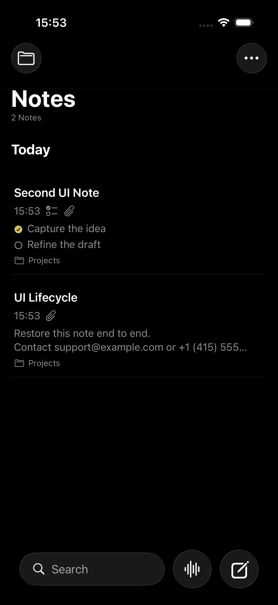
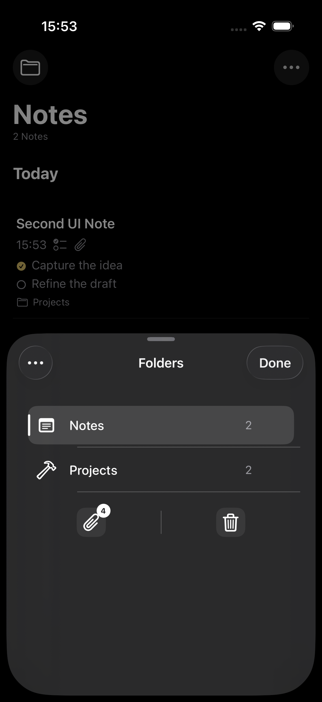
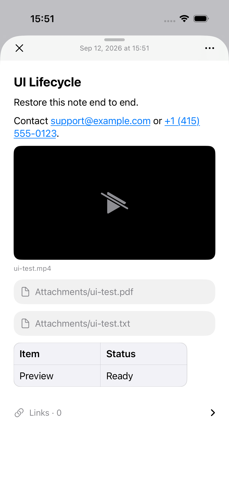
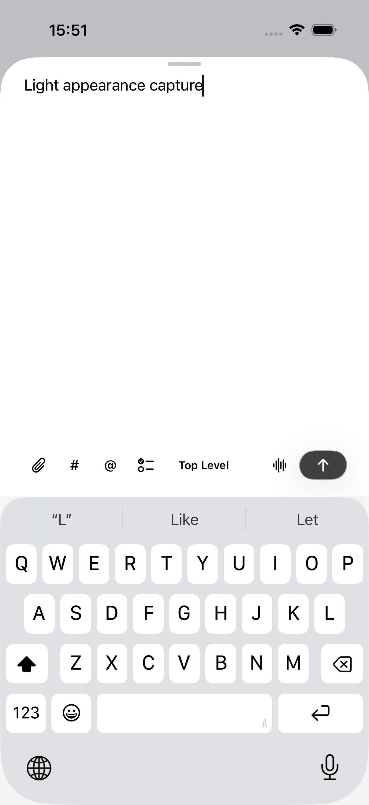
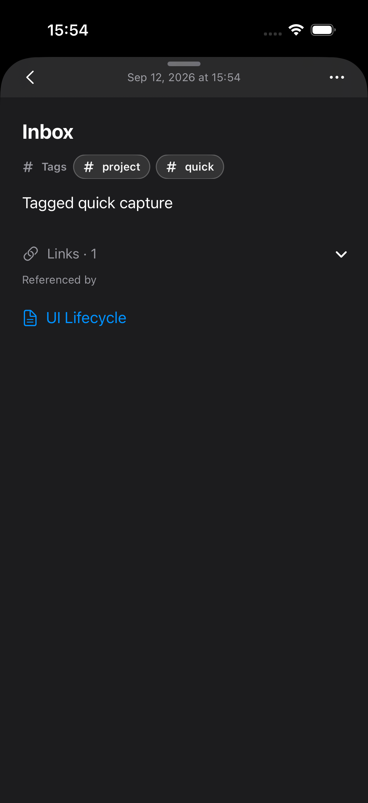
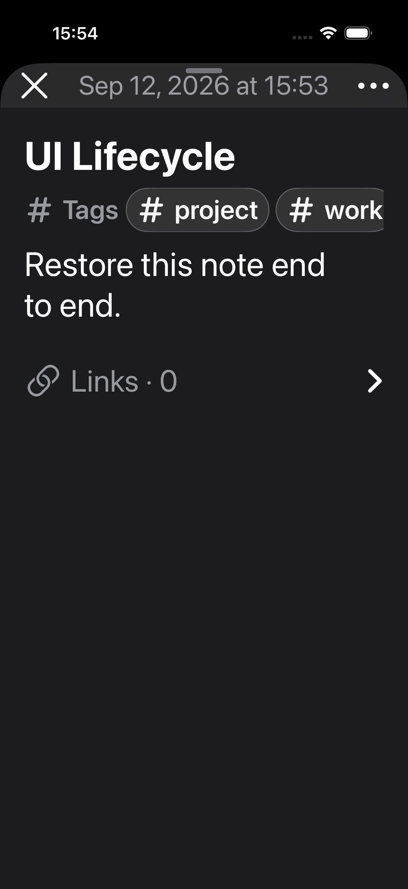
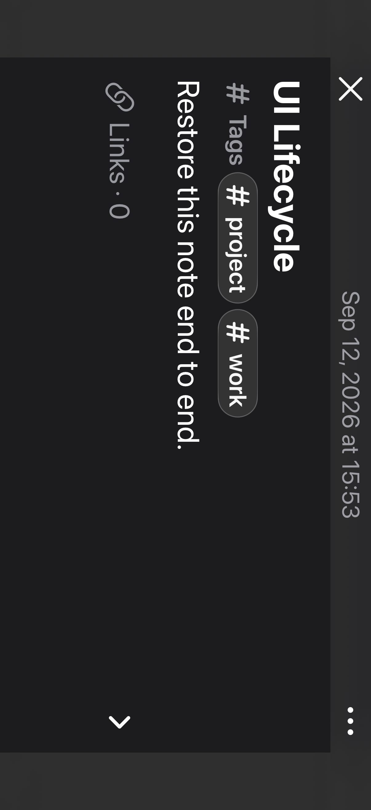

# iPhone visual and functional review — 2026-09-12

Scope: `ios`. This change retains the existing iPhone device family (`1`), iOS
17 deployment floor, note files, folders, and tags. It does not enable an iPad
layout or include macOS runtime changes.

## User-visible changes

- Creation-time sorting, date sections, and row/card metadata consistently use
  creation time; modified-time sorting retains its own date basis.
- New installations start with the compact list; an explicitly saved list or
  gallery preference remains authoritative.
- A small folder button opens a native material sheet. Folder management uses
  its menu. Tags, Smart Folders, Settings, attachments, and Recently Deleted
  open on the library navigation stack after the sheet closes.
- The reader uses a large sheet, an opaque reading surface, and a restrained
  material header with Close and a native action menu. Linked notes expose
  Previous Note; an edge swipe also returns through link history.
- Links are collapsed below the body. Outgoing links, incoming references,
  and up to three shared-tag suggestions use the existing library index.
  Adding a suggestion writes a portable Markdown link through the editor's
  existing autosave path.
- Link history reloads the saved file rather than restoring an old body
  snapshot. Failed link navigation leaves the current note visible.
- The Markdown parser excludes code examples, front matter, and images from
  backlinks and understands titled, escaped, and reference-style links.
- Reader links use the adaptive system link color instead of fixed yellow,
  keeping them legible on both light and dark reading surfaces. Primary
  commands and saved-state toasts use a contrasting adaptive foreground;
  inactive tag chips use an adaptive surface.
- Directory destinations make the whole row tappable, including the space
  between its label and count.
- Large text no longer shares an overlapping timestamp/save-status row or a
  fixed-height tag strip. Decorative material is hidden from accessibility.

## Review decisions

The retired custom drawer geometry, drag state, haptics, and corresponding
geometry tests were removed. Native folder sheets own their dismissal.
The speculative regular-width split view and skipped iPad test were removed;
an iPad simulator running an iPhone-only target is not iPad validation.

Folder navigation waits for sheet dismissal before pushing a destination,
so opening a note from a tag or Smart Folder does not ask the root to present
a reader over a competing folder sheet. The selected ordinary folder still
projects notes in place and persists by library ID.

## Verification

All UI checks used synthetic fixtures on the iPhone 17 simulator with iOS 26.5.

| Check | Result |
| --- | --- |
| Final `IOS_VERIFY_PARALLEL_FULL=1 ./scripts/verify ios full` | 181 unit tests and 14 focused UI tests passed; Release build succeeded |
| Extended functional review and targeted reruns | 27 distinct UI cases passed across all review batches |
| `./scripts/test_verify_ios_destination.sh` | Passed |
| `./scripts/agent_context.sh --check`, shell syntax, `git diff --check` | Passed |
| Built Debug and Release app metadata | iPhone family `1`, minimum iOS `17.0` |
| Simulator delivery | Verified Debug app installed and launched; installed executable SHA-256 matches the build |
| Physical phone | CoreDevice reports MudsPhone unavailable; no physical installation or launch attempted |

The 27 UI cases cover list/gallery preference, sorting and selection, folder
selection and management, tag routes, Smart Folder create/edit/delete, search
filters and suggestions, native reader actions, autosave and reopen, link
insertion and directions, saved-content history and edge-swipe return,
capture controls and draft recovery, move/delete/restore, permission recovery,
light/dark appearance, and accessibility text in portrait and landscape.
This is focused and extended review coverage, not a claim that every UI test
in the repository was run. Native iPad behavior and physical-device signing
remain outside this iPhone simulator delivery.

The final XCTest result is retained locally at
`build/IOSVerifyDerivedData/Logs/Test/Test-MudsnoteCompanion-2026.09.12_15-50-31-+0800.xcresult`.
The light reader's unavailable video preview is an intentionally synthetic
attachment fixture, not a media-playback certification.

## Screenshot evidence

These unaltered screenshots are exported from the final successful XCTest run.

| Library | Native folders |
| --- | --- |
|  |  |

| Light reader | Light capture |
| --- | --- |
|  |  |

| Incoming links | Accessibility text |
| --- | --- |
|  |  |

